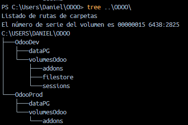
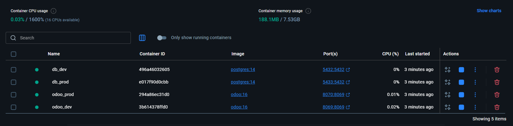

# PR0402

[Atrás](../index.md)

---

1. Creo el archivo compose.yml:

```yml
services:
  # Desarrollo
  postgresdev:
    image: postgres:14
    container_name: db_dev
    environment:
      - POSTGRES_DB=postgres
      - POSTGRES_USER=odoo
      - POSTGRES_PASSWORD=paso
    ports:
      - '5432:5432' # Puerto estándar de Postgres
    volumes:
    # Persistencia de la BBDD de desarrollo
      - ~/OdooDev/dataPG:/var/lib/postgresql/data

  odoodev:
    image: odoo:16
    container_name: odoo_dev
    environment:
      - HOST=postgresdev # Apunta al servicio de BBDD de desarrollo
      - USER=odoo
      - PASSWORD=paso
    ports:
      - '8069:8069' # Puerto estándar de Odoo
    volumes:
    # Mapeo de los volumenes
      - ~/OdooDev/volumesOdoo/addons:/mnt/extra-addons
      - ~/OdooDev/volumesOdoo/filestore:/var/lib/odoo/filestore
      - ~/OdooDev/volumesOdoo/sessions:/var/lib/odoo/sessions
    depends_on:
      - postgresdev # Odoo no arrancará hasta que postgresdev esté listo
    command: --dev=all

  # Producción
  postgresprod:
    image: postgres:14
    container_name: db_prod
    environment:
      - POSTGRES_DB=postgres
      - POSTGRES_USER=odoo
      - POSTGRES_PASSWORD=paso_prod
    ports:
    # Usamos el 5433 ya que el de desarrollo ya está ocupando el 5432
      - '5433:5432'
    volumes:
    # Persistencia de la BBDD de producción
      - ~/OdooProd/dataPG:/var/lib/postgresql/data

  odooprod:
    image: odoo:16
    container_name: odoo_prod
    environment:
      - HOST=postgresprod
      - USER=odoo
      - PASSWORD=paso_prod
    ports:
    # Usamos el 8070 ya que el de desarrollo ya está ocupando el 8069
      - '8070:8069'
    depends_on:
      - postgresprod
    volumes:
      - ~/OdooProd/volumesOdoo/addons:/mnt/extra-addons
```

2. Creo la estructura de carpetas necesaria:

    

3. Me coloco en el directorio donde tengo el archivo compose.yml y levanto los contenedores con "docker compose up -d":

    

4. Están listos:

    

---
[Atrás](../index.md)