# PR0301

[Atrás](../index.md)

---

- Inicio los contenedores que he levantado con docker compose up -d.

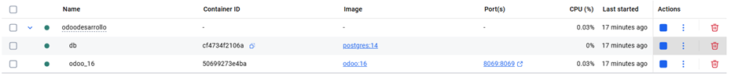

- Abro un navegador y entro en el puerto que he especificado en el archivo compose (8069).

- Relleno el formulario de registro e inicio sesión.

- Configuro la información de la compañía en el botón "Empecemos!".

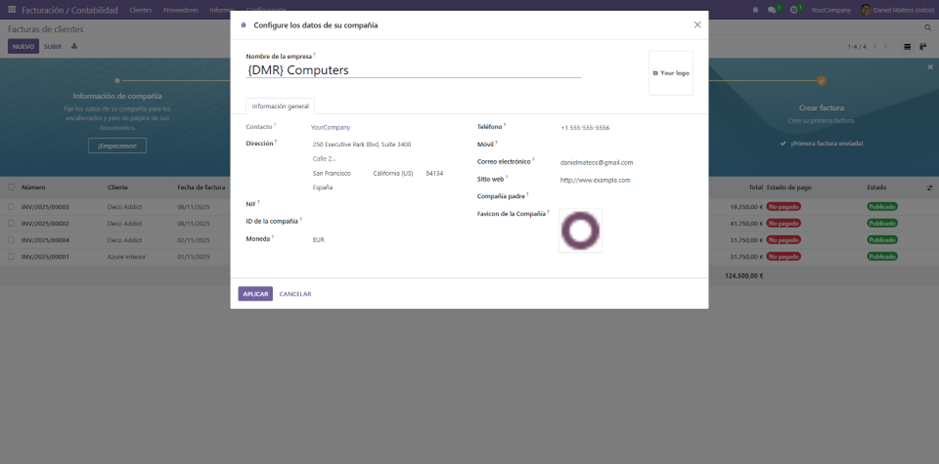

- Voy a los ajustes de odoo y le doy a Gestionar usuarios -> Nuevo.

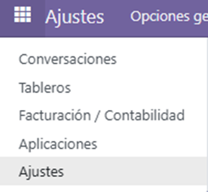
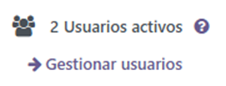
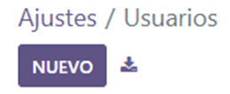

- Relleno los datos del usuario y lo guardo (Icono de nube)

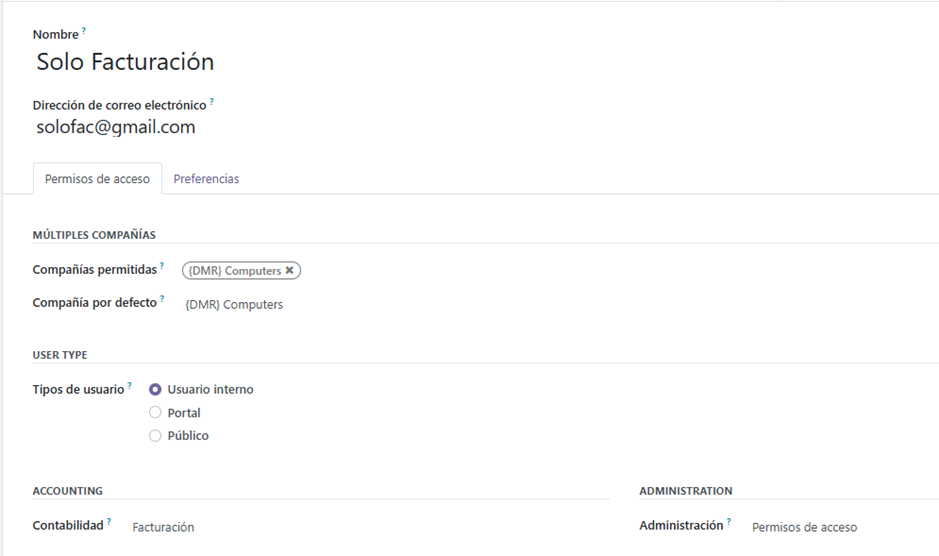
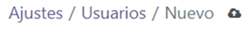

- Configuro el diseño de las imagenes dándole a "Personalizar".

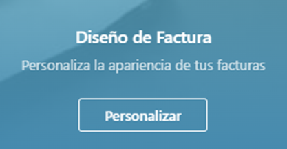

- Selecciono el logo y los colores de los encabezados y botones.

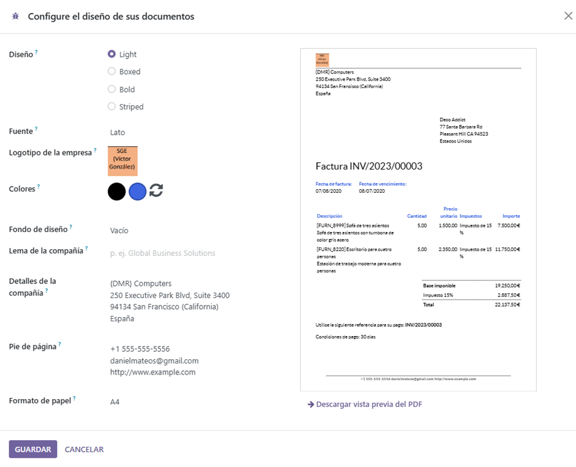

- Vuelvo a los ajustes y en el apartado de Facturación/Contabilidad habilito los Códigos QR para los pagos de los clientes.

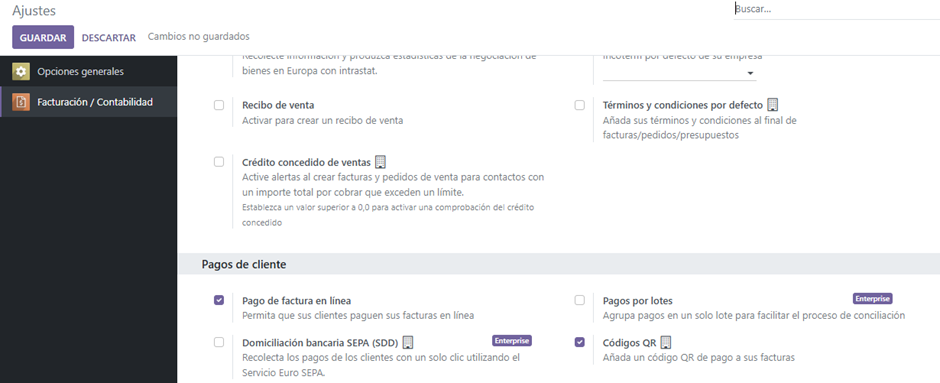

- Importo los clientes desde un archivo csv y relaciono los campos de mi archivo con los de Odoo.

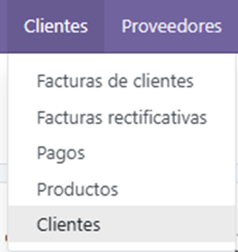
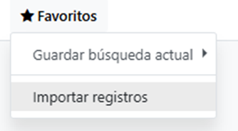
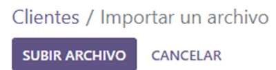

- Le pongo contraseña al usuario creado anteriormente para poder acceder con el e inicio sesión.

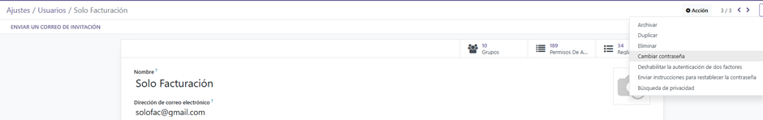

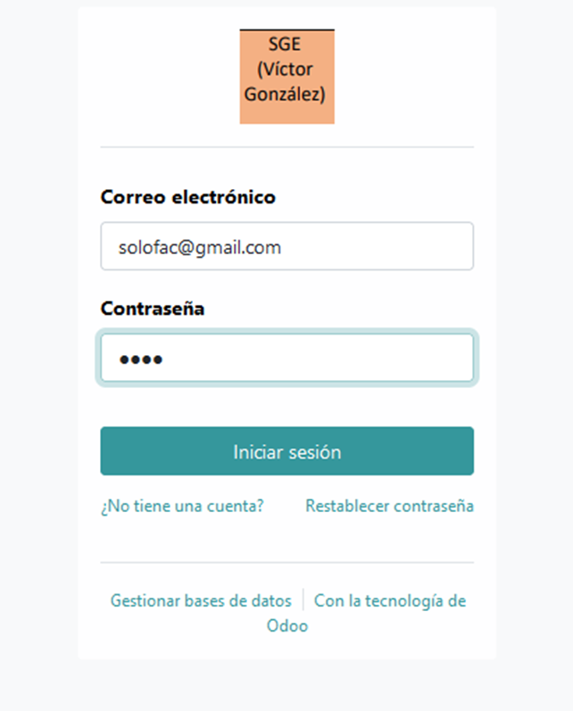

- Nueva factura, relleno los campos y los confirmo.

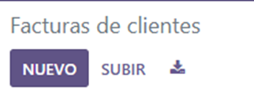
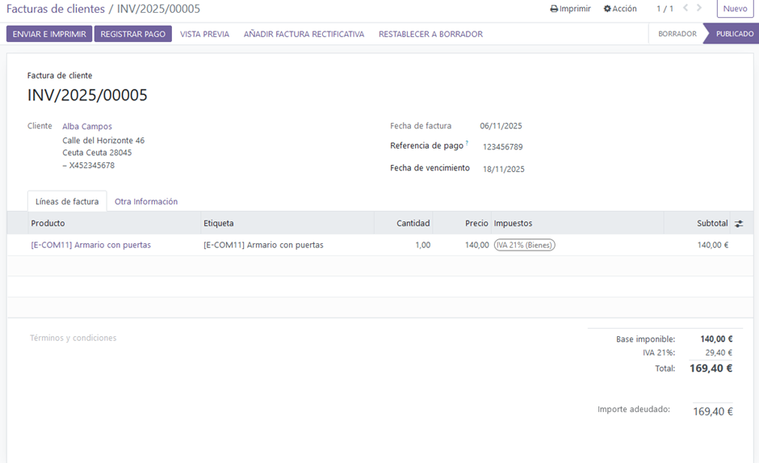

- Imprimo la factura generada.

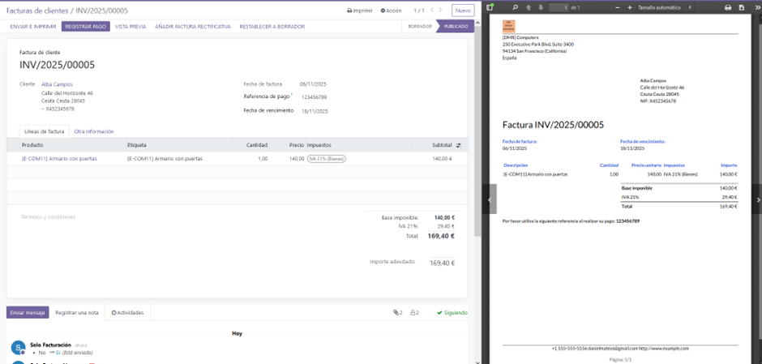