# PR0302

- Entro al dashboard de APIs y servicios de google y crear crear un nuevo proyecto.

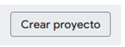
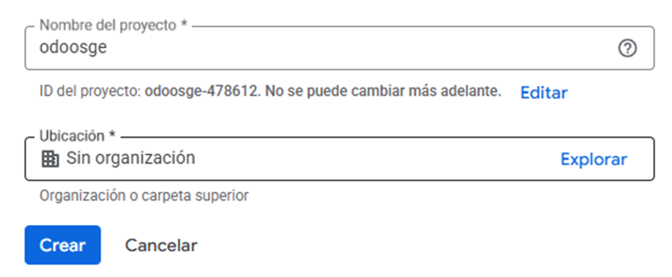

- Entro al apartado de Credenciales y creo una Clave de API.

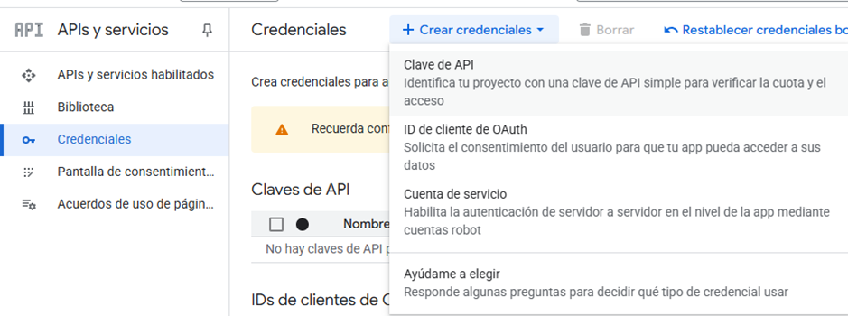

- En el buscador de arriba, busco "custom search api" y lo habilito para realizar búsquedas RESTful en internet.

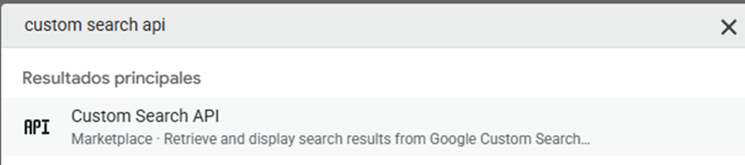
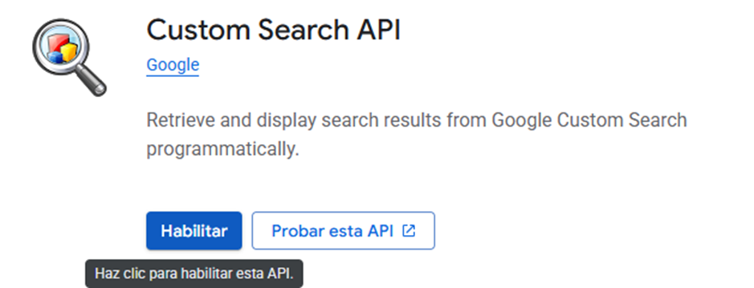

- Ahora voy al Google Programmable Search Dashboard y le doy a Get started.

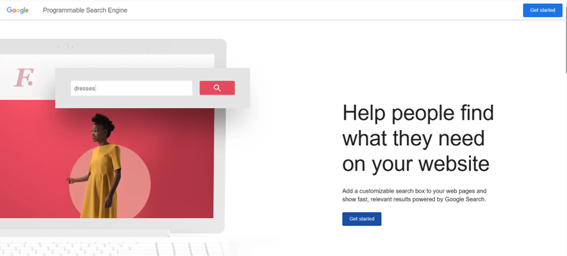

- Configuro la busqueda para que sea por imágenes, segura y en toda la Web.

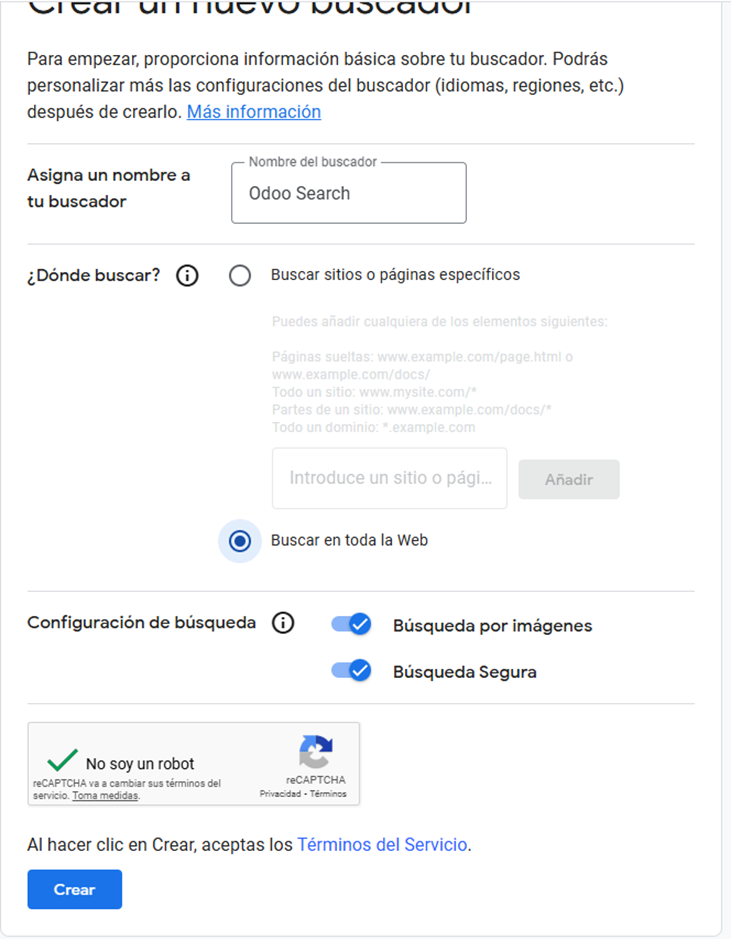

- Lo que nos interesa es el id, por lo que le damos a Personalizar y lo copiamos.

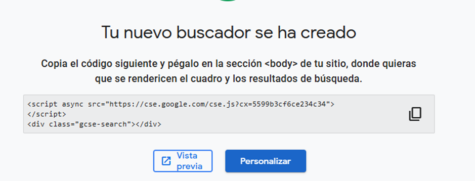

- Volvemos a Odoo y activamos el módulo de inventario en Aplicaciones.

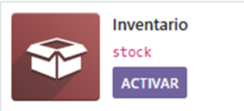

- Vamos a Ajustes y configuramos la Integración de Google Imágenes.

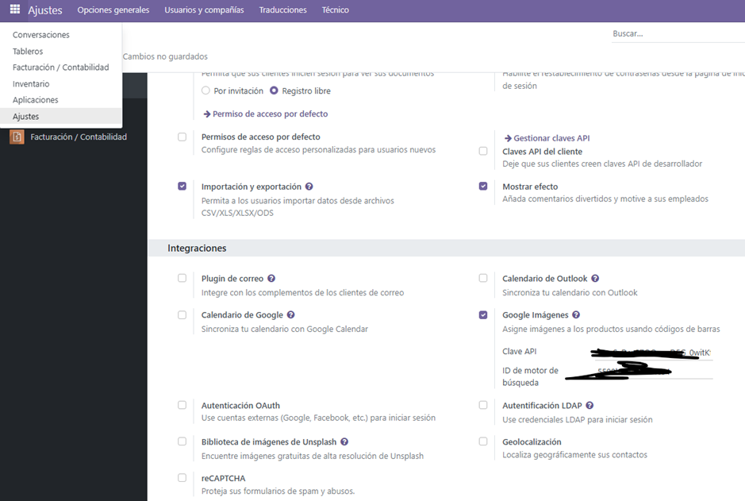

- Importo los libros para probar que funciona, asegurandonos de incluid el Código de barras.

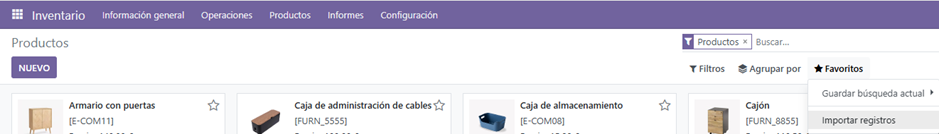
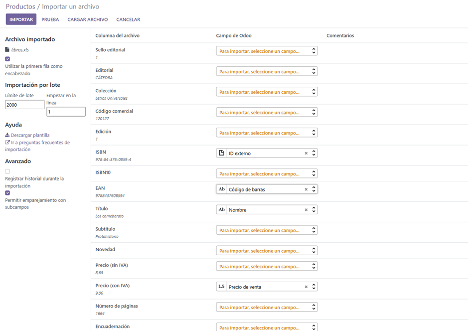

- Selecciono los productos y en Acción -> Obtener imágenes de Google Imágenes.

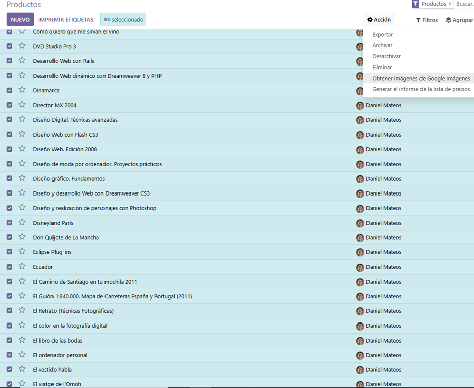

- Obtener imágenes. Comprobamos que funciona correctamente.

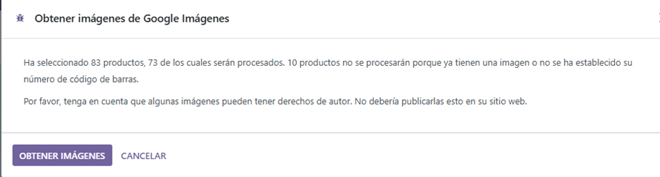
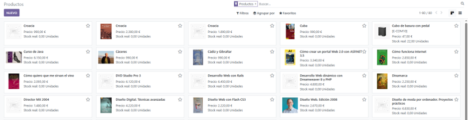