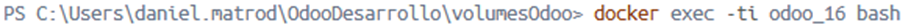
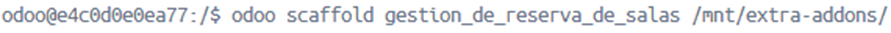
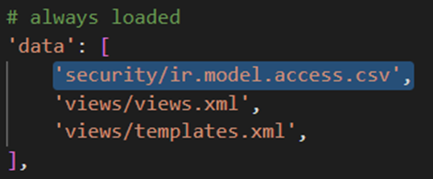
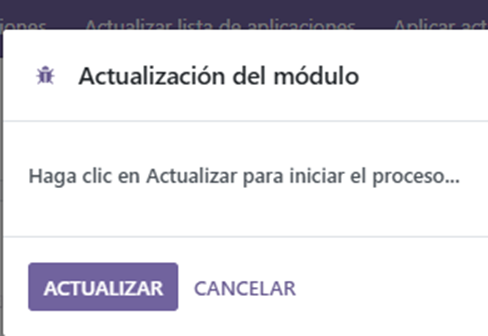
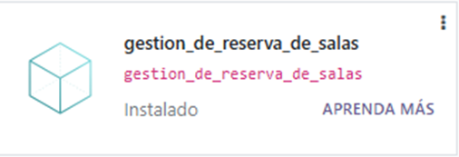
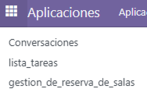
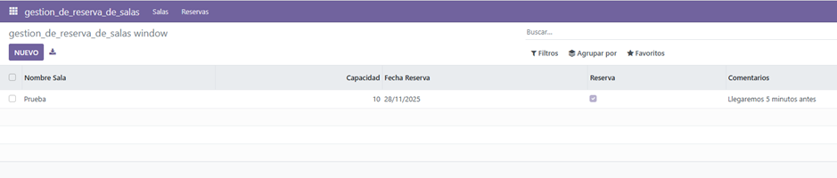

# PR0501

[Atrás](../index.md)

---

- Desde la carpeta de volumesOdoo, ejecuto el docker exec sobre el contenedor de odoo. 


- Una vez cambiado el prompt ejecuto odoo scaffold para crear una plantilla para el modelo.


- Edito los siguientes archivos:
  
views.xml
   
```xml
<odoo>
  <data>
    <!-- explicit list view definition -->

    <record model="ir.ui.view" id="gestion_de_reserva_de_salas.list">
      <field name="name">gestion_de_reserva_de_salas list</field>
      <field name="model">gestion_de_reserva_de_salas.gestion_de_reserva_de_salas</field>
      <field name="arch" type="xml">
        <tree>
          <field name="nombre_sala"/>
          <field name="capacidad"/>
          <field name="fecha_reserva"/>
          <field name="reserva"/>
          <field name="comentarios"/>
        </tree>
      </field>
    </record>


    <!-- actions opening views on models -->

    <record model="ir.actions.act_window" id="gestion_de_reserva_de_salas.action_window">
      <field name="name">gestion_de_reserva_de_salas window</field>
      <field name="res_model">gestion_de_reserva_de_salas.gestion_de_reserva_de_salas</field>
      <field name="view_mode">tree,form</field>
    </record>


    <!-- server action to the one above -->
<!--
    <record model="ir.actions.server" id="gestion_de_reserva_de_salas.action_server">
      <field name="name">gestion_de_reserva_de_salas server</field>
      <field name="model_id" ref="model_gestion_de_reserva_de_salas_gestion_de_reserva_de_salas"/>
      <field name="state">code</field>
      <field name="code">
        action = {
          "type": "ir.actions.act_window",
          "view_mode": "tree,form",
          "res_model": model._name,
        }
      </field>
    </record>
-->

    <!-- Top menu item -->

    <menuitem name="gestion_de_reserva_de_salas" id="gestion_de_reserva_de_salas.menu_root"/>

    <!-- menu categories -->

    <menuitem name="Salas" id="gestion_de_reserva_de_salas.salas" parent="gestion_de_reserva_de_salas.menu_root"/>
    <menuitem name="Reservas" id="gestion_de_reserva_de_salas.reservas" parent="gestion_de_reserva_de_salas.menu_root"/>

    <!-- actions -->

    <menuitem name="Salas Disponibles" id="gestion_de_reserva_de_salas.salas_salas_disponibles" parent="gestion_de_reserva_de_salas.salas"
    action="gestion_de_reserva_de_salas.action_window"/>
    <menuitem name="Reservas realizadas" id="gestion_de_reserva_de_salas.reservas_reservas_realizadas" parent="gestion_de_reserva_de_salas.reservas"
    action="gestion_de_reserva_de_salas.action_window"/>

  </data>
</odoo>
```

models.py
   
```python
# -*- coding: utf-8 -*-

from odoo import models, fields, api


class lista_tareas(models.Model):
    _name = 'lista_tareas.lista_tareas'
    _description = 'lista_tareas.lista_tareas'

    name = fields.Char()
    value = fields.Integer()
    value2 = fields.Float(compute="_value_pc", store=True)
    description = fields.Text()

```

En el archivo \_\_manifest\_\_.py descomento la siguiente linea: 
   
   ```python
   'security/ir.model.access.csv',
   ```


- Voy a odoo y le doy a "Actualizar lista de aplicaciones".

   
- Busco la aplicación y la instalo.


- Compruebo que se ha instalado y que puedo crear salas.

   
---
[Atrás](../index.md)
