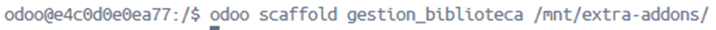
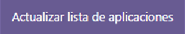
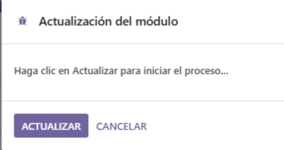
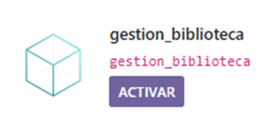
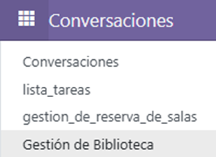
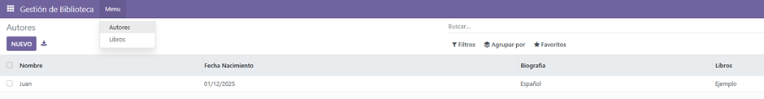
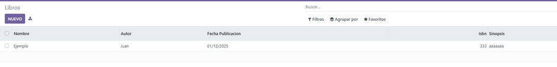

# PR0502

[Atrás](../index.md)

---

- Ejecuto docker exec -ti sobre el contenedor de odoo.


- Ejecuto el comando odoo scaffold para crear la estructura de mi módulo gestion_biblioteca.



- Creo los modelos "Libro" y "Autor".

Libro.py
```py
from odoo import models, fields, api


class gestion_biblioteca_libro(models.Model):
    _name = 'gestion_biblioteca.libro'
    _description = 'gestion_biblioteca.gestion_biblioteca_libro'

    nombre = fields.Text()
    autor = fields.Char()
    fecha_publicacion = fields.Date()
    isbn = fields.Integer()
    sinopsis = fields.Text()
```

Autor.py
```py
from odoo import models, fields, api


class gestion_biblioteca_autor(models.Model):
    _name = 'gestion_biblioteca.autor'
    _description = 'gestion_biblioteca.gestion_biblioteca_autor'

    nombre = fields.Text()
    fecha_nacimiento = fields.Date()
    biografia = fields.Text()
    libros = fields.Text()
```

- Importo los modelos en el archivo "\_\_init\_\_.py"

```py
from . import models
from . import Autor
from . import Libro
```

- Relleno los archivos views de cada modelo:

gestion_biblioteca_libro_views.xml

```xml
<odoo>
  <record model="ir.ui.view" id="view_gestion_biblioteca_libro_tree">
    <field name="name">gestion_biblioteca_libro list</field>
    <field name="model">gestion_biblioteca.libro</field>
    <field name="arch" type="xml">
      <tree>
        <field name="nombre"/>
        <field name="autor"/>
        <field name="fecha_publicacion"/>
        <field name="isbn"/>
        <field name="sinopsis"/>
      </tree>
    </field>
  </record>

  <record model="ir.actions.act_window" id="action_gestion_biblioteca_libro">
    <field name="name">Libros</field>
    <field name="res_model">gestion_biblioteca.libro</field>
    <field name="view_mode">tree,form</field>
  </record>
</odoo>
```

gestion_biblioteca_autor_views.xml

```xml
<odoo>
  <record model="ir.ui.view" id="view_gestion_biblioteca_autor_tree"> 
    <field name="name">gestion_biblioteca_autor list</field>
    <field name="model">gestion_biblioteca.autor</field>
    <field name="arch" type="xml">
      <tree>
        <field name="nombre"/>
        <field name="fecha_nacimiento"/>
        <field name="biografia"/>
        <field name="libros"/>
      </tree>
    </field>
  </record>
  
  <record model="ir.actions.act_window" id="action_gestion_biblioteca_autor">
      <field name="name">Autores</field>
      <field name="res_model">gestion_biblioteca.autor</field>
      <field name="view_mode">tree,form</field>
  </record>
  
</odoo>
``` 

gestion_biblioteca_menu_views

```xml
<odoo>
        <menuitem name="Gestión de Biblioteca" id="menu_gestion_biblioteca_root"/>
        <menuitem name="Menu" id="menu_gestion_biblioteca_menu" parent="menu_gestion_biblioteca_root"/>

        <menuitem name="Autores" id="menu_gestion_biblioteca_autor" parent="menu_gestion_biblioteca_menu"
        action="action_gestion_biblioteca_autor"/> 

        <menuitem name="Libros" id="menu_gestion_biblioteca_libro" parent="menu_gestion_biblioteca_menu" 
        action="action_gestion_biblioteca_libro"/>
</odoo>
```

- Edito las reglas de acceso en el archivo "ir.model.access".

```csv
id,name,model_id:id,group_id:id,perm_read,perm_write,perm_create,perm_unlink
access_gestion_biblioteca_libro,gestion_biblioteca.libro,model_gestion_biblioteca_libro,base.group_user,1,1,1,1
access_gestion_biblioteca_autor,gestion_biblioteca.autor,model_gestion_biblioteca_autor,base.group_user,1,1,1,1
```

- En el manifest, descomento la linea de security, añado los nuevos views en el manifest y elimino la referencia al views.xml.

```py
'data': [
        'security/ir.model.access.csv',
        'views/templates.xml',
        'views/gestion_biblioteca_autor_views.xml',
        'views/gestion_biblioteca_libro_views.xml',
        'views/gestion_biblioteca_menu_views.xml',
    ],
```

- Voy a odoo, actualizo la lista de aplicaciones y la activo.





- Compruebo que funciona correctamente.





---
[Atrás](../index.md)