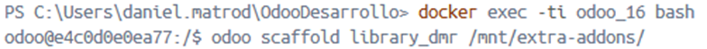
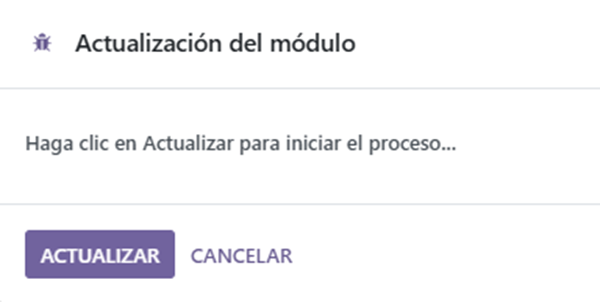
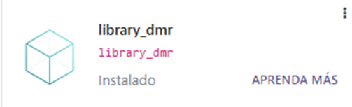

# PR0602

[Atrás](../index.md)

---

- Desde la carpeta de volumesOdoo, ejecuto docker exec sobre el contenedor de odoo y ejecuto odoo scaffold para crear una plantilla para el modelo.



- Creo los siguientes ficheros:

library_dmr_libros

```py
class library_dmr_libros(models.Model):
    _name = 'library_dmr.libros'
    _description = 'library_dmr.library_dmr'

    titulo = fields.Char(String="Título")
    autor = fields.Char(String="Autor")
    genero  = fields.Selection(
        [
            ('novela', 'Novela'),
            ('drama', 'Drama'),
            ('ciencia ficcion', 'Ciencia Ficción'),
            ('misterio', 'Misterio'),
            ('misterio', 'Misterio'),
            ('historico', 'Histórico'),
        ],
        String="Género"
    )
    socios_ids = fields.Many2many(
        'library_dmr',
        string='Socios',
    )
    libros_autor = fields.Many2one(
        comodel_name = 'library_dmr.autores',
        string='Libros de autor',
    )
    
```

library_dmr_autores

```py
class library_dmr_autores(models.Model):
    _name = 'library_dmr.autores'
    _description = 'library_dmr.library_dmr'

    nombre = fields.Char(String="Nombre")
    pais_origen = res.country(String="País de origen")
    libros = fields.One2Many(
        comodel_name='library_dmr.libros',
        String="Libros escritos"
    )
```

library_dmr_socios
```py
class library_dmr_socios(models.Model):
    _name = 'library_dmr.socios'
    _description = 'library_dmr.library_dmr'

    nombre = fields.Char(String="Mombre")
    telefono = fields.Char(String="Teléfono")
    libros_prestados = fields.Many2one(
        'library_dmr.libros',
        String="Libros prestados"
        
    )
```

- Añado los nuevos modelos al fichero '\_\_init\_\_'

```py
# -*- coding: utf-8 -*-

from . import models
from . import library_dmr_libros
from . import library_dmr_autores
from . import library_dmr_socios
```

- Añado los respectivos permisos en el fichero 'ir.model.access'

```csv
id,name,model_id:id,group_id:id,perm_read,perm_write,perm_create,perm_unlink
access_library_dmr_autores,library_dmr.autores,model_library_dmr_autores,base.group_user,1,1,1,1
access_library_dmr_libros,library_dmr.libros,model_library_dmr_libros,base.group_user,1,1,1,1
access_library_dmr_socios,library_dmr.socios,model_library_dmr_socios,base.group_user,1,1,1,1
```

- Descomento la línea de security del fichero '\_\_manifest\_\_'

```py
'data': [
    'security/ir.model.access.csv',
    'views/views.xml',
    'views/templates.xml',
],
```

- Actualizamos las aplicaciones y lo actualizamos

 



---
[Atrás](../index.md)
