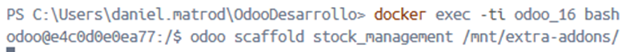
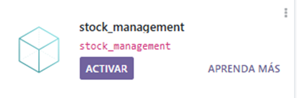
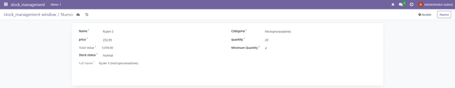
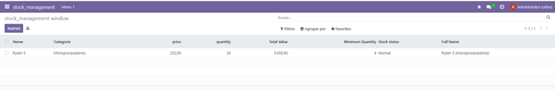

# PR0603

[Atrás](../index.md)

---

- Desde la carpeta de volumesOdoo, ejecuto docker exec sobre el contenedor de odoo y ejecuto odoo scaffold para crear una plantilla para el modelo.




- Creo los siguientes ficheros:

Creo el modelo:
  
```py
# -*- coding: utf-8 -*-

from odoo import models, fields, api
from odoo.exceptions import ValidationError


class stock_management(models.Model):
    _name = 'stock_management.stock_management'
    _description = 'stock_management.stock_management'
    _sql_constraints = [
        ('unique_name', 'unique(name)', 'El nombre debe ser único'),
        ('check_stock', 'CHECK(quantity >= 0)', 'El stock debe ser mayor o igual a 0')
    ]

    name = fields.Char()
    category = fields.Selection(
        [
            ('microprocesadores', 'Microprocesadores'),
            ('pantallas', 'Pantallas'),
            ('ratones', 'Ratones'),
        ],
        string="Categoría"
    )
    price = fields.Float('price')
    quantity = fields.Integer('quantity')
    total_value = fields.Float( compute = "_compute_total_value")
    minimum_quantity = fields.Integer(default = 0)
    stock_status = fields.Selection(
        [
            ('low_stock', 'Low Stock'),
            ('normal', 'Normal'),
        ],
        string="Stock status"
    )
    full_name = fields.Text(compute = "_compute_full_name")

    @api.depends('quantity', 'price')
    def _compute_total_value(self):
        for record in self:
            record.total_value = record.quantity * record.price

    @api.depends('name', 'category')
    def _compute_full_name(self):
        for record in self:
            nombre = record.name or ""
            categoria = record.category or ""
            if nombre and categoria:
                record.full_name = f"{nombre} ({categoria})"
            else:
                record.full_name = nombre or categoria or ""

    @api.constrains('price')
    def _check_price(self):
        for record in self:
            if record.price < 0:
                raise ValidationError('El precio debe ser mayor que 0')

    @api.constrains('quantity')
    def _check_quantity(self):
        for record in self:
            if record.quantity <= record.minimum_quantity:
                raise ValidationError('El stock debe ser mayor o igual que la cantidad mínima seleccionada')

    @api.constrains('total_value')
    def _check_total_value(self):
        for record in self:
            if record.total_value > 100000:
                raise ValidationError('El valor total del stock debe ser inferior a 100000 unidades monetarias')
```

La view
```xml
<odoo>
  <data>
    <!-- explicit list view definition -->

    <record model="ir.ui.view" id="stock_management.list">
      <field name="name">stock_management list</field>
      <field name="model">stock_management.stock_management</field>
      <field name="arch" type="xml">
        <tree>
          <field name="name"/>
          <field name="category"/>
          <field name="price"/>
          <field name="quantity"/>
          <field name="total_value"/>
          <field name="minimum_quantity"/>
          <field name="stock_status"/>
          <field name="full_name"/>
        </tree>
      </field>
    </record>


    <!-- actions opening views on models -->

    <record model="ir.actions.act_window" id="stock_management.action_window">
      <field name="name">stock_management window</field>
      <field name="res_model">stock_management.stock_management</field>
      <field name="view_mode">tree,form</field>
    </record>


    <!-- Top menu item -->

    <menuitem name="stock_management" id="stock_management.menu_root"/>

    <!-- menu categories -->

    <menuitem name="Menu 1" id="stock_management.menu_1" parent="stock_management.menu_root"/>

    <!-- actions -->

    <menuitem name="List" id="stock_management.menu_1_list" parent="stock_management.menu_1"
              action="stock_management.action_window"/>

  </data>
</odoo>
```

\_\_init\_\_ de la carpeta models
```py
# -*- coding: utf-8 -*-

from . import stock_product
```

- Descomento la línea de security del manifiesto
```py
'data': [
        'security/ir.model.access.csv',
        'views/views.xml',
        'views/templates.xml',
    ],
```
- Voy a odoo, actualizo la lista de aplicaciones y la activo.


- Lo pruebo y me deja crear un producto correctamente




---
[Atrás](../index.md)
