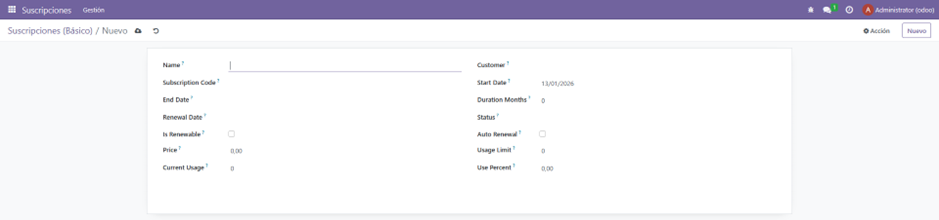
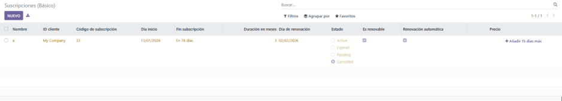
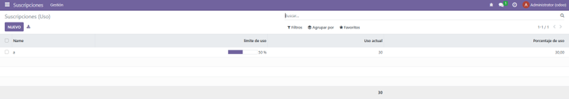

# PR0604

[Atrás](../index.md)

---

- Desde la carpeta de volumesOdoo, ejecuto docker exec sobre el contenedor de odoo y ejecuto odoo scaffold para crear una plantilla para el modelo.
  
- Edito los siguientes ficheros:
  
El modelo:

```py
# -*- coding: utf-8 -*-

from odoo import models, fields
from odoo.tools import date_utils

class subscription(models.Model):
    _name = 'subscription.subscription'
    _description = 'subscription.subscription'

    name = fields.Char(required=True)
    customer_id = fields.Many2one(required=True, comodel_name = 'res.partner')
    subscription_code = fields.Char(required=True, unique=True)
    start_date = fields.Date(required=True, default=fields.Date.context_today)
    end_date = fields.Date()
    duration_months = fields.Integer()
    renewal_date = fields.Date()
    status = fields.Selection(
        [
            ('active', 'Active'),
            ('expired', 'Expired'),
            ('pending', 'Pending'),
            ('cancelled', 'Cancelled'),
        ],
        string="Status"
    )
    is_renewable = fields.Boolean()
    auto_renewal = fields.Boolean()
    price = fields.Float()
    usage_limit = fields.Integer()
    current_usage = fields.Integer()
    use_percent = fields.Float()

    def action_add_days(self):
        for record in self:
            if record.end_date:
                nueva_fecha = record.end_date + date_utils.get_timedelta(15, "day")
                record.end_date = nueva_fecha

```

La view:

```xml
<odoo>
  <data>
    <!-- explicit list view definition -->

    <record model="ir.ui.view" id="view_subscription_tree_basic">
      <field name="name">subscription list</field>
      <field name="model">subscription.subscription</field>
      <field name="arch" type="xml">
        <tree decoration-danger="status=='expired'" decoration-warning="status=='cancelled'" limit="15">
          <field name="name" string="Nombre"/>
          <field name="customer_id" string="ID cliente"/>
          <field name="subscription_code" string="Código de subscripción"/>
          <field name="start_date" string="Dia inicio"/>
          <field name="end_date" string="Fin subscripción" widget="remaining_days"/>
          <field name="duration_months" string="Duración en meses"/>
          <field name="renewal_date" string="Dia de renovación"/>
          <field name="status" string="Estado" widget="radio"/>
          <field name="is_renewable" string="Es renovable"/>
          <field name="auto_renewal" string="Renovación automática"/>
          <field name="price" string="Precio" attrs="{'invisible':[('status','=','cancelled')]}"/>
          <button name="action_add_days" string="Añadir 15 días más" icon='fa-plus' type="object"/>
        </tree>
      </field>
    </record>

    <record model="ir.ui.view" id="view_subscription_tree_usage">
      <field name="name">subscription list</field>
      <field name="model">subscription.subscription</field>
      <field name="arch" type="xml">
        <tree decoration-danger="usage_limit&gt;80" limit="15">
          <field name="name"/>
          <field name="usage_limit" string="límite de uso" widget="progressbar"/>
          <field name="current_usage" string="Uso actual" avg="1"/>
          <field name="use_percent" string="Porcentaje de uso"/>
        </tree>
      </field>
    </record>

    <!-- actions opening views on models -->

    <record id="action_subscription_basic" model="ir.actions.act_window">
        <field name="name">Suscripciones (Básico)</field>
        <field name="res_model">subscription.subscription</field>
        <field name="view_mode">tree,form</field>
        <field name="view_id" ref="view_subscription_tree_basic"/>
    </record>
    <record id="action_subscription_usage" model="ir.actions.act_window">
        <field name="name">Suscripciones (Uso)</field>
        <field name="res_model">subscription.subscription</field>
        <field name="view_mode">tree,form</field>
        <field name="view_id" ref="view_subscription_tree_usage"/>
    </record>

    <menuitem name="Suscripciones" id="menu_root"/>

    <menuitem name="Gestión" id="menu_1" parent="menu_root"/>

    <menuitem name="Listado Básico" 
              id="menu_1_list_basic" 
              parent="menu_1"
              action="action_subscription_basic"/>

    <menuitem name="Listado de Uso" 
              id="menu_1_list_usage" 
              parent="menu_1"
              action="action_subscription_usage"/>

  </data>
</odoo>
```

- Descomento la linea 'security/ir.model.access.csv' del manifest:

```py
'data': [
        'security/ir.model.access.csv',
        'views/views.xml',
        'views/templates.xml',
    ],
```

- Compruebo que funcione todo correctamente



Vista básica


Vista de uso


---
[Atrás](../index.md)