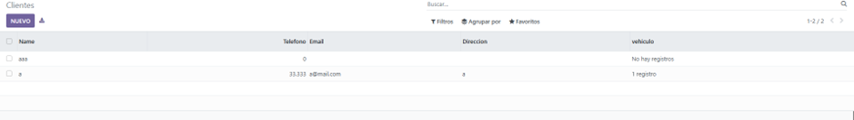
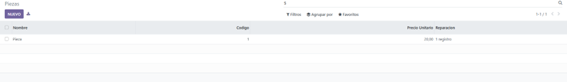
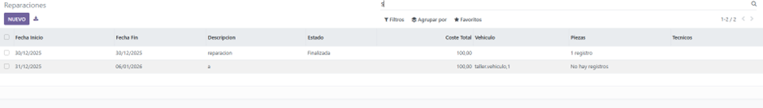
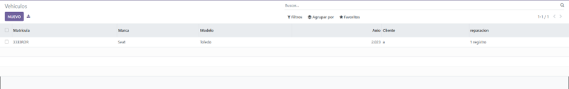

# PR0606

[Atrás](../index.md)

---

- Desde la carpeta de volumesOdoo, ejecuto docker exec sobre el contenedor de odoo y ejecuto odoo scaffold para crear una plantilla para el modelo.
  
- Creo los modelos y las views de cada uno:

cliente
```py
# -*- coding: utf-8 -*-

from odoo import models, fields, api


class cliente(models.Model):
    _name = 'taller.cliente'
    _description = 'taller.cliente'

    name = fields.Char()
    telefono = fields.Integer()
    email = fields.Text()
    direccion = fields.Text()
    vehiculo = fields.One2many(
        string="vehiculo",
        comodel_name="taller.vehiculo",
        inverse_name= "cliente_id"
    )
```

```xml
<odoo>
  <data>
    <record model="ir.ui.view" id="view_cliente_tree">
      <field name="name">taller.cliente.tree</field>
      <field name="model">taller.cliente</field>
      <field name="arch" type="xml">
        <tree>
          <field name="name"/>
          <field name="telefono"/>
          <field name="email"/>
          <field name="direccion"/>
          <field name="vehiculo"/>
        </tree>
      </field>
    </record>

    <record model="ir.actions.act_window" id="action_cliente_window">
      <field name="name">Clientes</field>
      <field name="res_model">taller.cliente</field>
      <field name="view_mode">tree,form</field>
      <field name="view_id" ref="view_cliente_tree"/>
    </record>
  </data>
</odoo>
```

pieza
```py
# -*- coding: utf-8 -*-

from odoo import models, fields, api


class pieza(models.Model):
    _name = 'taller.pieza'
    _description = 'taller.pieza'

    nombre = fields.Char()
    codigo = fields.Integer()
    precio_unitario = fields.Float()
    reparaciones_ids = fields.Many2many(
        string="Reparacion",
        comodel_name="taller.reparacion"
    )
```

```xml
<odoo>
  <data>
    <record model="ir.ui.view" id="view_pieza_tree">
      <field name="name">taller.pieza.tree</field>
      <field name="model">taller.pieza</field>
      <field name="arch" type="xml">
        <tree>
          <field name="nombre"/>
          <field name="codigo"/>
          <field name="precio_unitario"/>
          <field name="reparaciones_ids"/>
        </tree>
      </field>
    </record>

    <record model="ir.actions.act_window" id="action_pieza_window">
      <field name="name">Piezas</field>
      <field name="res_model">taller.pieza</field>
      <field name="view_mode">tree,form</field>
      <field name="view_id" ref="view_pieza_tree"/>
    </record>
  </data>
</odoo>
```

reparacion
```py
# -*- coding: utf-8 -*-

from odoo import models, fields, api


class reparacion(models.Model):
    _name = 'taller.reparacion'
    _description = 'taller.reparacion'

    fecha_inicio = fields.Date()
    fecha_fin = fields.Date()
    descripcion = fields.Text()
    estado = fields.Selection(
        [
            ('borrador', 'Borrador'),
            ('en_curso', 'En curso'),
            ('finalizada', 'Finalizada'),
        ],
        string="Estado"
    )
    coste_total = fields.Float()

    vehiculo_id = fields.Many2one(
        string="Vehiculo",
        comodel_name="taller.vehiculo"
    )
    
    piezas_ids = fields.Many2many(
        string="Piezas",
        comodel_name="taller.pieza"
    )

    tecnico_id = fields.Many2one(
        string="Tecnicos",
        comodel_name="res.users",
    )
```

```xml
<odoo>
  <data>
    <record model="ir.ui.view" id="view_reparacion_tree">
      <field name="name">taller.reparacion.tree</field>
      <field name="model">taller.reparacion</field>
      <field name="arch" type="xml">
        <tree>
          <field name="fecha_inicio"/>
          <field name="fecha_fin"/>
          <field name="descripcion"/>
          <field name="estado"/>
          <field name="coste_total"/>
          <field name="vehiculo_id"/> 
          <field name="piezas_ids"/>
          <field name="tecnico_id"/>
        </tree>
      </field>
    </record>

    <record model="ir.actions.act_window" id="action_reparacion_window">
      <field name="name">Reparaciones</field>
      <field name="res_model">taller.reparacion</field>
      <field name="view_mode">tree,form</field>
      <field name="view_id" ref="view_reparacion_tree"/>
    </record>
    
  </data>
</odoo>
```

vehiculo
```py
# -*- coding: utf-8 -*-

from odoo import models, fields, api


class vehiculo(models.Model):
    _name = 'taller.vehiculo'
    _description = 'taller.vehiculo'

    matricula = fields.Char()
    marca = fields.Char()
    modelo = fields.Char()
    anio = fields.Integer()

    cliente_id = fields.Many2one(
        string="Cliente",
        comodel_name="taller.cliente"
    )

    reparacion = fields.One2many(
        string="reparacion",
        comodel_name="taller.reparacion",
        inverse_name="vehiculo_id"
    )
```

```xml
<odoo>
  <data>
    <record model="ir.ui.view" id="view_vehiculo_tree">
      <field name="name">taller.vehiculo.tree</field>
      <field name="model">taller.vehiculo</field>
      <field name="arch" type="xml">
        <tree>
          <field name="matricula"/>
          <field name="marca"/>
          <field name="modelo"/>
          <field name="anio"/>
          <field name="cliente_id"/>
          <field name="reparacion"/>
        </tree>
      </field>
    </record>

    <record model="ir.actions.act_window" id="action_vehiculo_window">
      <field name="name">Vehiculos</field>
      <field name="res_model">taller.vehiculo</field>
      <field name="view_mode">tree,form</field>
      <field name="view_id" ref="view_vehiculo_tree"/>
    </record>
  </data>
</odoo>
```

Menús
```xml
<odoo>
    <data>
        <menuitem name="Taller" id="menu_taller_root"/>

        <menuitem name="Gestión" 
                  id="menu_taller_gestion" 
                  parent="menu_taller_root"/>

        <menuitem name="Cliente" 
                  id="menu_taller_cliente" 
                  parent="menu_taller_gestion" 
                  action="action_cliente_window"/>

        <menuitem name="Pieza" 
                  id="menu_taller_pieza" 
                  parent="menu_taller_gestion" 
                  action="action_pieza_window"/>

        <menuitem name="Reparacion" 
                  id="menu_taller_reparacion" 
                  parent="menu_taller_gestion" 
                  action="action_reparacion_window"/>

        <menuitem name="Vehiculo" 
                  id="menu_taller_vehiculo" 
                  parent="menu_taller_gestion" 
                  action="action_vehiculo_window"/>
    </data>
</odoo>
```

- Importo los modelos creados en el archivo init de la carpeta models
```py
from . import cliente,pieza,reparacion,vehiculo
```

- Modifico el manifiesto para que utilice mis vistas
```py
'data': [
        'security/ir.model.access.csv',
        'views/cliente.xml',
        'views/pieza.xml',
        'views/reparacion.xml',
        'views/vehiculo.xml',
        'views/menus.xml',
    ],
```

- Modifico el archivo de seguridad
```csv
id,name,model_id:id,group_id:id,perm_read,perm_write,perm_create,perm_unlink
access_taller_cliente,taller.cliente,model_taller_cliente,base.group_user,1,1,1,1
access_taller_pieza,taller.pieza,model_taller_pieza,base.group_user,1,1,1,1
access_taller_reparacion,taller.reparacion,model_taller_reparacion,base.group_user,1,1,1,1
access_taller_vehiculo,taller.vehiculo,model_taller_vehiculo,base.group_user,1,1,1,1
```

- Lo pruebo y funciona correctamente






---
[Atrás](../index.md)