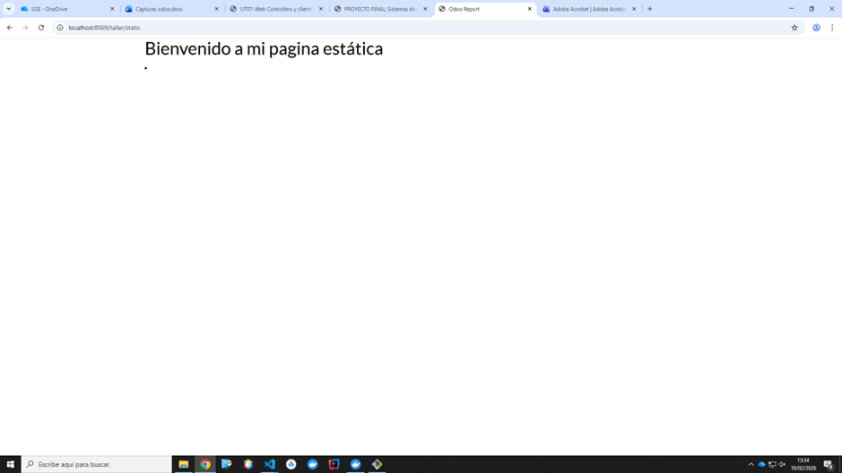
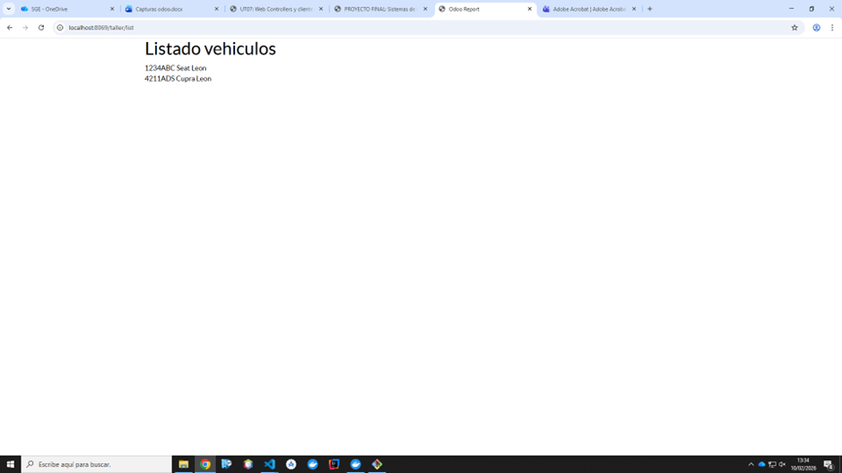

# PR0701

[Atrás](../index.md)

---

- Creo los siguientes archivos en la carpeta "controllers" del módulo taller:

estatica.py
```py
from odoo import http


class Estatica(http.Controller):
    @http.route('/taller/static',type='http', auth='public', website=True)
    def welcome(self, **kw):
        return http.request.render('taller.static_web', {})
```

dinamica.py
```py
from odoo import http
from odoo.http import request

class Dinamica(http.Controller):
    @http.route('/taller/list',type='http', auth='public', website=True)
    def vehiculo_list_web(self, **kw):
        vehiculos = request.env['taller.vehiculo'].search([])
        return http.request.render('taller.vehiculo_list_web', {
            'vehiculos':vehiculos
        })
```

- Añado ambos controller a init:

```py
from . import dinamica, estatica
```


- Creo las siguientes views:

static_web.xml
```xml
<odoo>
    <template id='taller.vehiculo_list_web'>
        <t t-call="web.html_container">
            <div class="container">
                <h1>Listado vehiculos</h1>
                <t t-foreach="vehiculos" t-as="v">
                    <div class="vehiculo">
                        <span><t t-esc="v.matricula"/></span>
                        <span><t t-esc="v.marca"/></span>
                        <span><t t-esc="v.modelo"/></span>
                    </div>
                </t>
            </div>
        </t>
    </template>
</odoo>
```

vehiculo_list_web.xml
```xml
<odoo>
    <template id='taller.vehiculo_list_web'>
        <t t-call="web.html_container">
            <div class="container">
                <h1>Listado vehiculos</h1>
                <t t-foreach="vehiculos" t-as="v">
                    <div class="vehiculo">
                        <span><t t-esc="v.matricula"/></span>
                        <span><t t-esc="v.marca"/></span>
                        <span><t t-esc="v.modelo"/></span>
                    </div>
                </t>
            </div>
        </t>
    </template>
</odoo>
```

- Añado ambas views al manifest:
  
```py
'views/static_web.xml',
'views/vehiculo_list_web.xml',
```

- Voy al buscador y pruebo ambas rutas. Funcionan correctamente:

Estática:


Dinámica:



---
[Atrás](../index.md)
