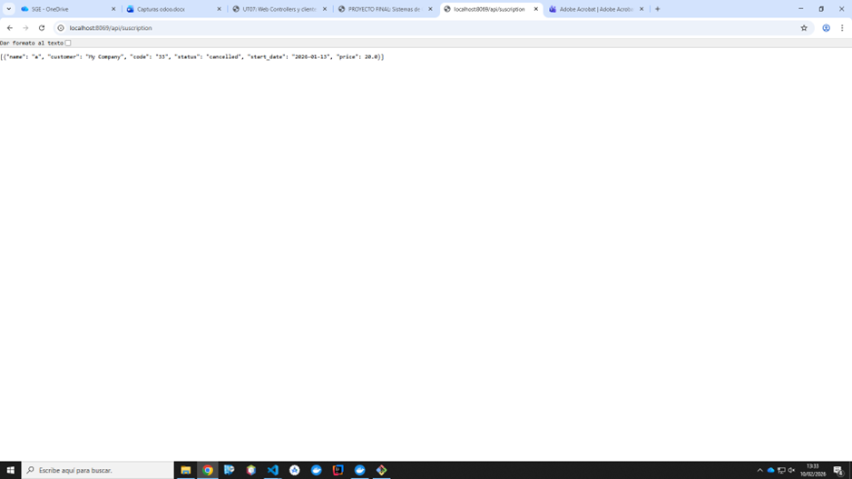
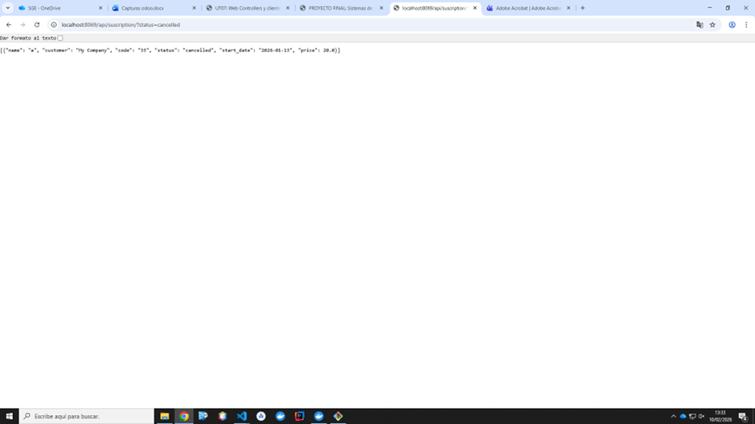
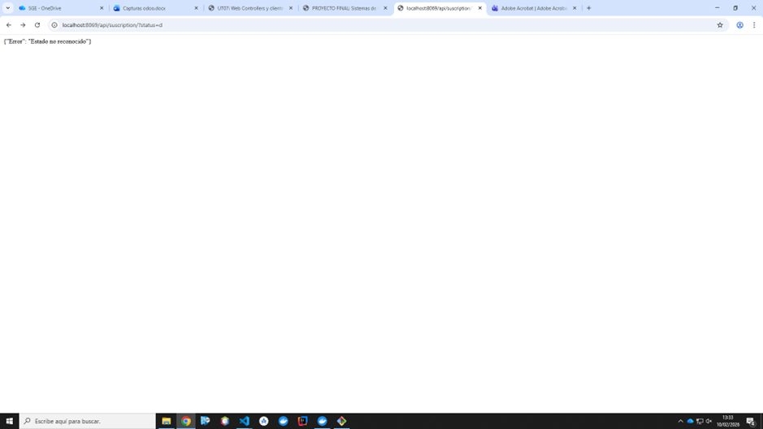

# PR0702

[Atrás](../index.md)

---

- Edito el archivo controllers.py de la carpeta controllers:
  
```py
from odoo import http
from odoo.http import request, Response
import json

class SubscriptionController(http.Controller):

    @http.route('/api/suscription', type='http', methods=['GET'], csrf=False, auth='public')
    def get_subscriptions(self, **kwargs):
        domain = []
        status = kwargs.get('status')
        
        if status:
            if status not in ['active', 'expired', 'pending', 'cancelled']:
                return Response(json.dumps({'Error': 'Estado no reconocido'}), status=400)
            domain.append(('status', '=', status))

        subs = request.env['subscription.subscription'].search(domain)
        result = []
        for sub in subs:
            result.append({
                'name': sub.name,
                'customer': sub.customer_id.name,
                'code': sub.subscription_code,
                'status': sub.status,
                'start_date': str(sub.start_date),
                'price': sub.price,
            })

        response = Response(
            json.dumps(result),
            content_type='application/json',
            status=200
        )
        return response

    @http.route('/api/suscription/<name>', type='http', methods=['GET'], csrf=False, auth='public')
    def get_subscription_detail(self, name):
        sub = request.env['subscription.subscription'].search([('name', '=', name)], limit=1)
        
        result = {}
        if sub:
            result = {
                'name': sub.name,
                'customer': sub.customer_id.name,
                'code': sub.subscription_code,
                'status': sub.status,
                'start_date': str(sub.start_date),
                'price': sub.price,
            }

        response = Response(
            json.dumps(result),
            content_type='application/json',
            status=200
        )
        return response
```

- Pruebo todas las rutas y funciona correctamente:






---
[Atrás](../index.md)
